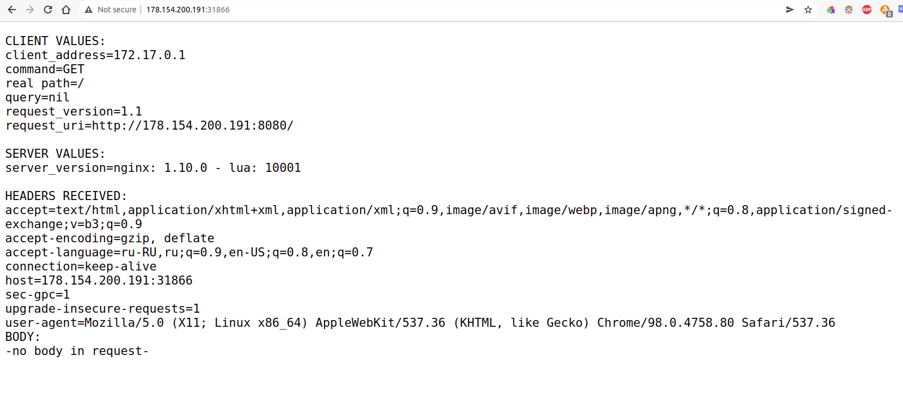

# Домашнее задание к занятию "12.1 Компоненты Kubernetes"

Вы DevOps инженер в крупной компании с большим парком сервисов. Ваша задача — разворачивать эти продукты в корпоративном кластере. 

## Задача 1: Установить Minikube

Для экспериментов и валидации ваших решений вам нужно подготовить тестовую среду для работы с Kubernetes. Оптимальное решение — развернуть на рабочей машине Minikube.

### Как поставить на AWS:
- создать EC2 виртуальную машину (Ubuntu Server 20.04 LTS (HVM), SSD Volume Type) с типом **t3.small**. Для работы потребуется настроить Security Group для доступа по ssh. Не забудьте указать keypair, он потребуется для подключения.
- подключитесь к серверу по ssh (ssh ubuntu@<ipv4_public_ip> -i <keypair>.pem)
- установите миникуб и докер следующими командами:
  - curl -LO https://storage.googleapis.com/kubernetes-release/release/`curl -s https://storage.googleapis.com/kubernetes-release/release/stable.txt`/bin/linux/amd64/kubectl
  - chmod +x ./kubectl
  - sudo mv ./kubectl /usr/local/bin/kubectl
  - sudo apt-get update && sudo apt-get install docker.io conntrack -y
  - curl -Lo minikube https://storage.googleapis.com/minikube/releases/latest/minikube-linux-amd64 && chmod +x minikube && sudo mv minikube /usr/local/bin/
- проверить версию можно командой minikube version
- переключаемся на root и запускаем миникуб: minikube start --vm-driver=none
- после запуска стоит проверить статус: minikube status
- запущенные служебные компоненты можно увидеть командой: kubectl get pods --namespace=kube-system

### Для сброса кластера стоит удалить кластер и создать заново:
- minikube delete
- minikube start --vm-driver=none

Возможно, для повторного запуска потребуется выполнить команду: sudo sysctl fs.protected_regular=0

Инструкция по установке Minikube - [ссылка](https://kubernetes.io/ru/docs/tasks/tools/install-minikube/)

**Важно**: t3.small не входит во free tier, следите за бюджетом аккаунта и удаляйте виртуалку.

## Задача 2: Запуск Hello World
После установки Minikube требуется его проверить. Для этого подойдет стандартное приложение hello world. А для доступа к нему потребуется ingress.

- развернуть через Minikube тестовое приложение по [туториалу](https://kubernetes.io/ru/docs/tutorials/hello-minikube/#%D1%81%D0%BE%D0%B7%D0%B4%D0%B0%D0%BD%D0%B8%D0%B5-%D0%BA%D0%BB%D0%B0%D1%81%D1%82%D0%B5%D1%80%D0%B0-minikube)
- установить аддоны ingress и dashboard

## Задача 3: Установить kubectl

Подготовить рабочую машину для управления корпоративным кластером. Установить клиентское приложение kubectl.
- подключиться к minikube 
- проверить работу приложения из задания 2, запустив port-forward до кластера

## Задача 4 (*): собрать через ansible (необязательное)

Профессионалы не делают одну и ту же задачу два раза. Давайте закрепим полученные навыки, автоматизировав выполнение заданий  ansible-скриптами. При выполнении задания обратите внимание на доступные модули для k8s под ansible.
 - собрать роль для установки minikube на aws сервисе (с установкой ingress)
 - собрать роль для запуска в кластере hello world
  
  ---


# Решение

## Задача 1. Установка minikube

### 1.1. Запуск ВМ с Ubuntu на YandexCloud с помощью терраформа. 

```tf
# ============main.tf==============
terraform {
  required_providers {
    yandex = {
      source  = "yandex-cloud/yandex"
      version = "0.68.0"
    }
  }
}

provider "yandex" {
  cloud_id  = "b1g3me49qkcgicgvrgv2"
  folder_id = "b1g4fb7qmqpe9rvo57q2"
  zone      = "ru-central1-a"
}

# Инстанс minikube
resource "yandex_compute_instance" "minikube-01" {
  name = "minikube-master"
  platform_id = "standard-v1"
  allow_stopping_for_update = true

  resources {
    cores = 2
    memory = 4
  }

  boot_disk {
    initialize_params {
      image_id = "fd8mfc6omiki5govl68h" # Ubuntu-20.04
      size = 10
    }
  }

  network_interface {
    subnet_id = "${yandex_vpc_subnet.subnet-01.id}"
    nat       = true
  }

  metadata = {
    ssh-keys = "ubuntu:${file("~/.ssh/id_ed25519.pub")}" # SSH key
  }  
}


resource "yandex_vpc_network" "network-01" {
  name = "network-01"
}

resource "yandex_vpc_subnet" "subnet-01" {
  name       = "subnet-01"
  v4_cidr_blocks = ["10.2.0.0/16"]
  zone       = "ru-central1-a"
  network_id = "${yandex_vpc_network.network-01.id}"
}

# ==============output.tf==================
output "external_ip_minikube_master" {
  value = yandex_compute_instance.minikube-01.network_interface.0.nat_ip_address
}
```

```bash
$ terraform apply
...
Outputs:

external_ip_minikube_master = "178.154.200.191"
```

Подключился к ВМ: `$ ssh ubuntu@178.154.200.191`.

### 1.2. Установка minikube. 

Установка:

```bash
curl -LO https://storage.googleapis.com/kubernetes-release/release/`curl -s https://storage.googleapis.com/kubernetes-release/release/stable.txt`/bin/linux/amd64/kubectl
chmod +x ./kubectl
sudo mv ./kubectl /usr/local/bin/kubectl
sudo apt-get update && sudo apt-get install docker.io conntrack -y
curl -Lo minikube https://storage.googleapis.com/minikube/releases/latest/minikube-linux-amd64 && chmod +x minikube && sudo mv minikube /usr/local/bin/
```

```shell
$ minikube version
minikube version: v1.25.2
commit: 362d5fdc0a3dbee389b3d3f1034e8023e72bd3a7
```

Запуск minikube:

```shell
$ sudo su
root@fhms9hp5r3klh4lpmtta:/home/ubuntu#
root@fhms9hp5r3klh4lpmtta:/home/ubuntu# minikube start --vm-driver=none
😄  minikube v1.25.2 on Ubuntu 20.04 (amd64)
.......
🏄  Done! kubectl is now configured to use "minikube" cluster and "default" namespace by default
```

Проверка статуса:

```shell
root@fhms9hp5r3klh4lpmtta:/home/ubuntu# minikube status
minikube
type: Control Plane
host: Running
kubelet: Running
apiserver: Running
kubeconfig: Configured
```
Проверка запущенных служб:

```shell
root@fhms9hp5r3klh4lpmtta:/home/ubuntu# kubectl get pods --namespace=kube-system
NAME                                           READY   STATUS    RESTARTS   AGE
coredns-64897985d-7kh6w                        1/1     Running   0          107s
etcd-fhms9hp5r3klh4lpmtta                      1/1     Running   0          2m3s
kube-apiserver-fhms9hp5r3klh4lpmtta            1/1     Running   0          119s
kube-controller-manager-fhms9hp5r3klh4lpmtta   1/1     Running   0          119s
kube-proxy-6d98m                               1/1     Running   0          108s
kube-scheduler-fhms9hp5r3klh4lpmtta            1/1     Running   0          119s
storage-provisioner                            1/1     Running   0          115s
```

## Задача 2: Запуск Hello World

### 2.1. Запуск тестового приложения.

Согласно документации, запустил веб-консоль, но как ее открыть, не понял.

```shell
root@fhms9hp5r3klh4lpmtta:/home/ubuntu# minikube dashboard --url
🤔  Verifying dashboard health ...
🚀  Launching proxy ...
🤔  Verifying proxy health ...
http://127.0.0.1:45595/api/v1/namespaces/kubernetes-dashboard/services/http:kubernetes-dashboard:/proxy/
^Z
[1]+  Stopped                 minikube dashboard --url
```

Запустил деплоймент:

```shell
root@fhms9hp5r3klh4lpmtta:/home/ubuntu# kubectl create deployment hello-node --image=k8s.gcr.io/echoserver:1.4
deployment.apps/hello-node created
```
Вывел список деплойментов:

```shell
root@fhms9hp5r3klh4lpmtta:/home/ubuntu# kubectl get deployments
NAME         READY   UP-TO-DATE   AVAILABLE   AGE
hello-node   1/1     1            1           13s
```
Список подов:

```shell
root@fhms9hp5r3klh4lpmtta:/home/ubuntu# kubectl get pods
NAME                          READY   STATUS    RESTARTS   AGE
hello-node-6b89d599b9-f7sdt   1/1     Running   0          2m12s
```
Список событий:

```shell
root@fhms9hp5r3klh4lpmtta:/home/ubuntu# kubectl get events
LAST SEEN   TYPE     REASON                    OBJECT                             MESSAGE
........
5m54s       Normal   Scheduled                 pod/hello-node-6b89d599b9-f7sdt    Successfully assigned default/hello-node-6b89d599b9-f7sdt to fhms9hp5r3klh4lpmtta
5m53s       Normal   Pulling                   pod/hello-node-6b89d599b9-f7sdt    Pulling image "k8s.gcr.io/echoserver:1.4"
5m46s       Normal   Pulled                    pod/hello-node-6b89d599b9-f7sdt    Successfully pulled image "k8s.gcr.io/echoserver:1.4" in 6.864412274s
5m44s       Normal   Created                   pod/hello-node-6b89d599b9-f7sdt    Created container echoserver
5m44s       Normal   Started                   pod/hello-node-6b89d599b9-f7sdt    Started container echoserver
5m54s       Normal   SuccessfulCreate          replicaset/hello-node-6b89d599b9   Created pod: hello-node-6b89d599b9-f7sdt
5m54s       Normal   ScalingReplicaSet         deployment/hello-node              Scaled up replica set hello-node-6b89d599b9 to 1
```
Просмотр конфига:

```shell
root@fhms9hp5r3klh4lpmtta:/home/ubuntu# kubectl config view
apiVersion: v1
clusters:
- cluster:
    certificate-authority: /root/.minikube/ca.crt
    extensions:
    - extension:
        last-update: Mon, 14 Mar 2022 04:18:25 UTC
        provider: minikube.sigs.k8s.io
        version: v1.25.2
      name: cluster_info
    server: https://10.2.0.33:8443
  name: minikube
contexts:
- context:
    cluster: minikube
    extensions:
    - extension:
        last-update: Mon, 14 Mar 2022 04:18:25 UTC
        provider: minikube.sigs.k8s.io
        version: v1.25.2
      name: context_info
    namespace: default
    user: minikube
  name: minikube
current-context: minikube
kind: Config
preferences: {}
users:
- name: minikube
  user:
    client-certificate: /root/.minikube/profiles/minikube/client.crt
    client-key: /root/.minikube/profiles/minikube/client.key
```
Открыл внешний порт для созданного сервиса:

```shell
root@fhms9hp5r3klh4lpmtta:/home/ubuntu# kubectl expose deployment hello-node --type=LoadBalancer --port=8080
service/hello-node exposed
```
Список сервисов:

```shell
root@fhms9hp5r3klh4lpmtta:/home/ubuntu# kubectl get services
NAME         TYPE           CLUSTER-IP       EXTERNAL-IP   PORT(S)          AGE
hello-node   LoadBalancer   10.101.186.182   <pending>     8080:31866/TCP   105s
kubernetes   ClusterIP      10.96.0.1        <none>        443/TCP          44m
```
В браузере зашел по адресу `http://178.154.200.191:31866/`:




### 2.2. Установка дополнений ingress и dashboard

```shell
root@fhms9hp5r3klh4lpmtta:/home/ubuntu# minikube addons enable ingress

root@fhms9hp5r3klh4lpmtta:/home/ubuntu# minikube addons list
|-----------------------------|----------|--------------|--------------------------------|
|         ADDON NAME          | PROFILE  |    STATUS    |           MAINTAINER           |
|-----------------------------|----------|--------------|--------------------------------|
| ambassador                  | minikube | disabled     | third-party (ambassador)       |
| auto-pause                  | minikube | disabled     | google                         |
| csi-hostpath-driver         | minikube | disabled     | kubernetes                     |
| dashboard                   | minikube | enabled ✅   | kubernetes                     |
| default-storageclass        | minikube | enabled ✅   | kubernetes                     |
| efk                         | minikube | disabled     | third-party (elastic)          |
| freshpod                    | minikube | disabled     | google                         |
| gcp-auth                    | minikube | disabled     | google                         |
| gvisor                      | minikube | disabled     | google                         |
| helm-tiller                 | minikube | disabled     | third-party (helm)             |
| ingress                     | minikube | enabled ✅   | unknown (third-party)          |
| ingress-dns                 | minikube | disabled     | google                         |
| istio                       | minikube | disabled     | third-party (istio)            |
| istio-provisioner           | minikube | disabled     | third-party (istio)            |
| kong                        | minikube | disabled     | third-party (Kong HQ)          |
| kubevirt                    | minikube | disabled     | third-party (kubevirt)         |
| logviewer                   | minikube | disabled     | unknown (third-party)          |
| metallb                     | minikube | disabled     | third-party (metallb)          |
| metrics-server              | minikube | disabled     | kubernetes                     |
| nvidia-driver-installer     | minikube | disabled     | google                         |
| nvidia-gpu-device-plugin    | minikube | disabled     | third-party (nvidia)           |
| olm                         | minikube | disabled     | third-party (operator          |
|                             |          |              | framework)                     |
| pod-security-policy         | minikube | disabled     | unknown (third-party)          |
| portainer                   | minikube | disabled     | portainer.io                   |
| registry                    | minikube | disabled     | google                         |
| registry-aliases            | minikube | disabled     | unknown (third-party)          |
| registry-creds              | minikube | disabled     | third-party (upmc enterprises) |
| storage-provisioner         | minikube | enabled ✅   | google                         |
| storage-provisioner-gluster | minikube | disabled     | unknown (third-party)          |
| volumesnapshots             | minikube | disabled     | kubernetes                     |
|-----------------------------|----------|--------------|--------------------------------|
```

## Задача 3: Установить kubectl

### 3.1. Установка kubectl

kubectl был установлен в первой задаче на удаленную ВМ. Установил на локальную машину.
Скопировал содержимое `root@fhm2feote4ceokv6a3nk:/etc/kubernetes/admin.conf` с удаленного хоста в локальный файл настроек `~/.kube/config`, заменив IP адрес мастера на внешний.

```yml
apiVersion: v1
clusters:
- cluster:
    certificate-authority-data: LS0tLS1CRUdJ.............0tLS0tCg==
    server: https://51.250.75.249:8443
  name: mk
contexts:
- context:
    cluster: mk
    user: kubernetes-admin
  name: kubernetes-admin@mk
current-context: kubernetes-admin@mk
kind: Config
preferences: {}
users:
- name: kubernetes-admin
  user:
    client-certificate-data: LS0tLS1CRUdJTiBDRVJUSUZJ......LS0tCg==
    client-key-data: LS0tLS1CRUdJTiBSU0EgUFJJVkFURSB.......LS0tCg==
```
Удалил minikube и запустил заново с флагом `--apiserver-ips`.

```sh
root@fhm2feote4ceokv6a3nk:/etc/kubernetes# minikube delete 

ubuntu@fhm2feote4ceokv6a3nk:~$ sudo sysctl fs.protected_regular=0
fs.protected_regular = 0

ubuntu@fhm2feote4ceokv6a3nk:~$ sudo minikube start --vm-driver=none --apiserver-ips=51.250.75.249
```
После этого kubectl заработал локально.

```sh
maxship@Ryzen5-Desktop:~/devops/devops-netology/12.02-kub
e-commands/ansible$ kubectl get nodes
NAME                   STATUS   ROLES                  AGE   VERSION
fhm2feote4ceokv6a3nk   Ready    control-plane,master   2m    v1.23.3
```


## Задача 4: Cобрать через ansible

Плейбук для установки minikube:

```YAML
#inventory/prod/hosts.yml
minikube_master:
  hosts:
    ubuntu:
      ansible_host: 193.32.218.118
      ansible_port: 22
      ansible_connection: ssh
      ansible_user: ubuntu


#install_minikube.yml
---
- name: Install minikube
  hosts: all

  tasks:
    - name: "Get minikube stable version"
      set_fact:
        minikube_version: "{{ lookup('url', 'https://storage.googleapis.com/kubernetes-release/release/stable.txt') }}"

    - name: "Download and install kubectl"
      become: true
      get_url:
        url: "https://storage.googleapis.com/kubernetes-release/release/{{ minikube_version }}/bin/linux/amd64/kubectl"
        dest: "/usr/local/bin/kubectl"
        mode: 0755

    - name: "Download and install minikube"
      become: true
      get_url:
        url: "https://storage.googleapis.com/minikube/releases/latest/minikube-linux-amd64"
        dest: "/usr/local/bin/minikube"
        mode: 0755

    - name: "Upgrade the OS"
      become: true
      apt:
        update_cache: yes
        upgrade: full

    - name: "Install docker"
      become: true
      apt: 
        name: docker.io
        state: present

    - name: "Install conntrack"
      become: true
      apt: 
        name: conntrack
        state: present

    - name: "Start minikube"
      become: true
      command: /usr/local/bin/minikube start --vm-driver=none

    - name: "Enable ingress addon"
      become: true
      command: /usr/local/bin/minikube addons enable ingress
```

Плейбук для установки тестового приложения:

```YML
#deploy_hello_world.yml
---
- name: Hello world
  hosts: all

  tasks:
    - name: "Deploy app"
      become: true
      command: /usr/local/bin/kubectl create deployment hello-node --image=k8s.gcr.io/echoserver:1.4

    - name: "Expose port"
      become: true
      command: /usr/local/bin/kubectl expose deployment hello-node --type=LoadBalancer --port=8080
```