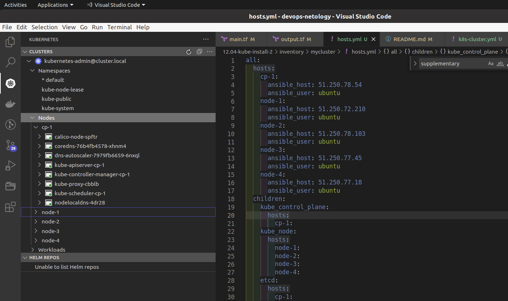

# Домашнее задание к занятию "12.4 Развертывание кластера на собственных серверах, лекция 2"
Новые проекты пошли стабильным потоком. Каждый проект требует себе несколько кластеров: под тесты и продуктив. Делать все руками — не вариант, поэтому стоит автоматизировать подготовку новых кластеров.

## Задание 1: Подготовить инвентарь kubespray
Новые тестовые кластеры требуют типичных простых настроек. Нужно подготовить инвентарь и проверить его работу. Требования к инвентарю:
* подготовка работы кластера из 5 нод: 1 мастер и 4 рабочие ноды;
* в качестве CRI — containerd;
* запуск etcd производить на мастере.

---

## Решение
### Задание 1.

#### Подготовка окружения.

Скачал репозиторий с Kubespray.

```shell script
git clone https://github.com/kubernetes-sigs/kubespray

# Установка зависимостей
sudo pip3 install -r requirements.txt

# Копирование примера в папку с вашей конфигурацией
cp -rfp inventory/sample inventory/mycluster
```

С помощью терраформа создал требуемые ресурсы на YC.
Для создания одинаковых нод воспользовался блоком `count`.

```tf
# terraform/main.tf

terraform {
  required_providers {
    yandex = {
      source  = "yandex-cloud/yandex"
      version = "0.68.0"
    }
  }
}

provider "yandex" {
  cloud_id  = "b1g3me49qkcgicgvrgv2"
  folder_id = "b1g4fb7qmqpe9rvo57q2"
  zone      = "ru-central1-a"
}

# control plane
resource "yandex_compute_instance" "cp-1" {
  
  name = "cp-1"

  platform_id = "standard-v1"
  allow_stopping_for_update = true

  resources {
    cores = 2
    memory = 2
  }

  boot_disk {
    initialize_params {
      image_id = "fd8mfc6omiki5govl68h" # Ubuntu-20.04
      size = 50
    }
  }

  network_interface {
    subnet_id = "${yandex_vpc_subnet.subnet-01.id}"
    nat       = true
  }

  metadata = {
    ssh-keys = "ubuntu:${file("~/.ssh/id_ed25519.pub")}"
  }  
}

# Инстансы node
resource "yandex_compute_instance" "node" {
  count = 4

  platform_id = "standard-v1"
  allow_stopping_for_update = true

  name = "node-${count.index+1}"

  resources {
    cores = 2
    memory = 2
  }

  boot_disk {
    initialize_params {
      image_id = "fd8mfc6omiki5govl68h" # Ubuntu-20.04
      size = 100
    }
  }

  network_interface {
    subnet_id = "${yandex_vpc_subnet.subnet-01.id}"
    nat       = true
  }

  metadata = {
    ssh-keys = "ubuntu:${file("~/.ssh/id_ed25519.pub")}"
  }  
}


resource "yandex_vpc_network" "network-01" {
  name = "network-01"
}

resource "yandex_vpc_subnet" "subnet-01" {
  name       = "subnet-01"
  v4_cidr_blocks = ["10.2.0.0/16"]
  zone       = "ru-central1-a"
  network_id = "${yandex_vpc_network.network-01.id}"
}


#terraform/output.tf

output "external_ip_control_plane" {
  value = yandex_compute_instance.cp-1.network_interface.0.nat_ip_address
}

output "external_ip_nodes" {
  value = yandex_compute_instance.node[*].network_interface.0.nat_ip_address
}
```
```shell
$terraform apply

external_ip_control_plane = "51.250.78.54"
external_ip_nodes = [
  "51.250.72.210",
  "51.250.78.103",
  "51.250.77.45",
  "51.250.77.18",
]
```

#### Настройка параметров кластера в Kubespray.

Прописал в переменных настройки для `containerd`.

```yml
#group_vars/k8s_cluster.yml
container_manager: containerd

#group_vars/all/etcd.yml
etcd_deployment_type: host
```
В файле `inventory/mycluster/hosts.yml` указал полученные ранее IP и прописал установку `etcd` на хост c `control panel`. 

```yml
all:
  hosts:
    cp-1:
      ansible_host: 51.250.78.54
      ansible_user: ubuntu
    node-1:
      ansible_host: 51.250.72.210
      ansible_user: ubuntu
    node-2:
      ansible_host: 51.250.78.103
      ansible_user: ubuntu
    node-3:
      ansible_host: 51.250.77.45
      ansible_user: ubuntu
    node-4:
      ansible_host: 51.250.77.18
      ansible_user: ubuntu
  children:
    kube_control_plane:
      hosts:
        cp-1:
    kube_node:
      hosts:
        node-1:
        node-2:
        node-3:
        node-4:
    etcd:
      hosts: 
        cp-1:
    k8s_cluster:
      children:
        kube_control_plane:
        kube_node:
    calico_rr:
      hosts: {}
```

#### Запуск кластера

Запустил плейбук в директории с Kubespray.

```shell
$ ansible-playbook -i inventory/mycluster/hosts.yml --become --become-user=root cluster.yml

PLAY RECAP ****************************************************************************************************************
cp-1                       : ok=687  changed=28   unreachable=0    failed=0    skipped=1230 rescued=0    ignored=2   
localhost                  : ok=4    changed=0    unreachable=0    failed=0    skipped=0    rescued=0    ignored=0   
node-1                     : ok=494  changed=17   unreachable=0    failed=0    skipped=713  rescued=0    ignored=1   
node-2                     : ok=494  changed=17   unreachable=0    failed=0    skipped=712  rescued=0    ignored=1   
node-3                     : ok=494  changed=17   unreachable=0    failed=0    skipped=712  rescued=0    ignored=1   
node-4                     : ok=494  changed=17   unreachable=0    failed=0    skipped=712  rescued=0    ignored=1   

Четверг 31 марта 2022  17:36:17 +0600 (0:00:00.063)       0:13:08.603 ********* 
=============================================================================== 
kubernetes-apps/ansible : Kubernetes Apps | Lay Down CoreDNS templates -------------------------------------------- 23.52s
kubernetes-apps/ansible : Kubernetes Apps | Start Resources ------------------------------------------------------- 20.70s
network_plugin/calico : Calico | Create calico manifests ---------------------------------------------------------- 14.27s
policy_controller/calico : Create calico-kube-controllers manifests ------------------------------------------------ 9.64s
network_plugin/calico : Start Calico resources --------------------------------------------------------------------- 9.59s
container-engine/containerd : containerd | Unpack containerd archive ----------------------------------------------- 8.54s
kubernetes/control-plane : Backup old certs and keys --------------------------------------------------------------- 8.02s
kubernetes/preinstall : Get current calico cluster version --------------------------------------------------------- 7.85s
kubernetes-apps/ansible : Kubernetes Apps | Lay Down nodelocaldns Template ----------------------------------------- 7.06s
kubernetes/preinstall : Create kubernetes directories -------------------------------------------------------------- 6.54s
kubernetes/node : install | Copy kubelet binary from download dir -------------------------------------------------- 6.54s
etcd : Check certs | Register ca and etcd admin/member certs on etcd hosts ----------------------------------------- 6.53s
container-engine/containerd : containerd | Remove orphaned binary -------------------------------------------------- 6.52s
etcd : Check certs | Register ca and etcd admin/member certs on etcd hosts ----------------------------------------- 6.40s
policy_controller/calico : Start of Calico kube controllers -------------------------------------------------------- 6.21s
kubernetes/node : Modprobe Kernel Module for IPVS ------------------------------------------------------------------ 5.72s
bootstrap-os : Install dbus for the hostname module ---------------------------------------------------------------- 5.57s
kubernetes/control-plane : Update server field in component kubeconfigs -------------------------------------------- 5.37s
kubernetes/control-plane : Backup old confs ------------------------------------------------------------------------ 5.29s
container-engine/containerd : containerd | Ensure containerd directories exist ------------------------------------- 5.26s
```
Проверил работоспособность кластера:

```shell
root@cp-1:/home/ubuntu# kubectl get nodes -o wide
NAME     STATUS   ROLES                  AGE   VERSION   INTERNAL-IP   EXTERNAL-IP   OS-IMAGE             KERNEL-VERSION     CONTAINER-RUNTIME
cp-1     Ready    control-plane,master   26m   v1.23.5   10.2.0.5      <none>        Ubuntu 20.04.3 LTS   5.4.0-96-generic   containerd://1.6.1
node-1   Ready    <none>                 24m   v1.23.5   10.2.0.26     <none>        Ubuntu 20.04.3 LTS   5.4.0-96-generic   containerd://1.6.1
node-2   Ready    <none>                 24m   v1.23.5   10.2.0.18     <none>        Ubuntu 20.04.3 LTS   5.4.0-96-generic   containerd://1.6.1
node-3   Ready    <none>                 24m   v1.23.5   10.2.0.7      <none>        Ubuntu 20.04.3 LTS   5.4.0-96-generic   containerd://1.6.1
node-4   Ready    <none>                 24m   v1.23.5   10.2.0.33     <none>        Ubuntu 20.04.3 LTS   5.4.0-96-generic   containerd://1.6.1
```

Скопировал настройки кластера.

```sh
root@cp-1:/home/ubuntu# cat /etc/kubernetes/admin.conf
```

Вставил содермиое на локальную машину, заменив IP мастера на внешний.

```sh
$ code ~/.kube/config

apiVersion: v1
clusters:
- cluster:
    certificate-authority-data: LS0tLS1CRUdJTiBDRVJUSUZJQ0FURS0tLS0tCk1JSUMvakNDQWVhZ0.....
    server: https://51.250.78.54:6443
  name: cluster.local
contexts:
- context:
    cluster: cluster.local
    user: kubernetes-admin
  name: kubernetes-admin@cluster.local
current-context: kubernetes-admin@cluster.local
kind: Config
preferences: {}
users:
- name: kubernetes-admin
  user:
    client-certificate-data: LS0tLS1CRUdJTiBDRVJUSUZJQ0FURS0tLS0tCk1JSURJVENDQWdtZ0F3SUJBZ0lJRkwxVGRnTEtzYlF3RFFZ.....
    client-key-data: LS0tLS1CRUdJTiBSU0EgUFJJVkFURSBLRVktLS0tLQpNSUlFcEFJQkFBS0NBUUVBdE1FVi85dFk4aGgxTHBw....
```

При подключении к кластеру ошибка:

```sh
Unable to connect to the server: x509: certificate is valid for 10.233.0.1, 10.2.0.5, 127.0.0.1, not 51.250.78.54
```

В настройках добавил сертификат на внешний IP.

```yml
#inventory/mycluster/group_vars/k8s_cluster/k8s-cluster.yml
supplementary_addresses_in_ssl_keys: [51.250.78.54]
```
После нового прогона плейбука, доступ к кластеру с удаленной машины заработал:

```sh
maxship@Ryzen5-Desktop:~/devops/kubespray/invento
ry/mycluster$ kubectl get nodes
NAME     STATUS   ROLES                  AGE   VERSION
cp-1     Ready    control-plane,master   59m   v1.23.5
node-1   Ready    <none>                 58m   v1.23.5
node-2   Ready    <none>                 58m   v1.23.5
node-3   Ready    <none>                 58m   v1.23.5
node-4   Ready    <none>                 58m   v1.23.5
```

---