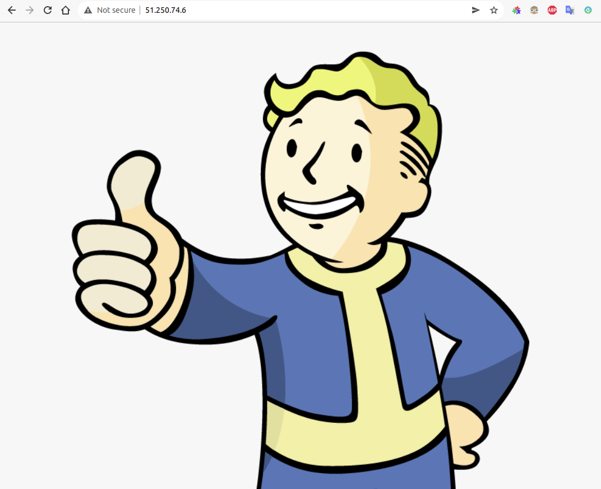

# Домашнее задание к занятию 15.2 "Вычислительные мощности. Балансировщики нагрузки".
Домашнее задание будет состоять из обязательной части, которую необходимо выполнить на провайдере Яндекс.Облако, и дополнительной части в AWS (можно выполнить по желанию). Все домашние задания в 15 блоке связаны друг с другом и в конце представляют пример законченной инфраструктуры.
Все задания требуется выполнить с помощью Terraform, результатом выполненного домашнего задания будет код в репозитории. Перед началом работ следует настроить доступ до облачных ресурсов из Terraform, используя материалы прошлых лекций и ДЗ.

---
## Задание 1. Яндекс.Облако (обязательное к выполнению)

1. Создать bucket Object Storage и разместить там файл с картинкой:
- Создать bucket в Object Storage с произвольным именем (например, _имя_студента_дата_);
- Положить в bucket файл с картинкой;
- Сделать файл доступным из Интернет.
2. Создать группу ВМ в public подсети фиксированного размера с шаблоном LAMP и web-страничкой, содержащей ссылку на картинку из bucket:
- Создать Instance Group с 3 ВМ и шаблоном LAMP. Для LAMP рекомендуется использовать `image_id = fd827b91d99psvq5fjit`;
- Для создания стартовой веб-страницы рекомендуется использовать раздел `user_data` в [meta_data](https://cloud.yandex.ru/docs/compute/concepts/vm-metadata);
- Разместить в стартовой веб-странице шаблонной ВМ ссылку на картинку из bucket;
- Настроить проверку состояния ВМ.
3. Подключить группу к сетевому балансировщику:
- Создать сетевой балансировщик;
- Проверить работоспособность, удалив одну или несколько ВМ.
4. *Создать Application Load Balancer с использованием Instance group и проверкой состояния.

Документация
- [Compute instance group](https://registry.terraform.io/providers/yandex-cloud/yandex/latest/docs/resources/compute_instance_group)
- [Network Load Balancer](https://registry.terraform.io/providers/yandex-cloud/yandex/latest/docs/resources/lb_network_load_balancer)
- [Группа ВМ с сетевым балансировщиком](https://cloud.yandex.ru/docs/compute/operations/instance-groups/create-with-balancer)
---
## Задание 2*. AWS (необязательное к выполнению)

Используя конфигурации, выполненные в рамках ДЗ на предыдущем занятии, добавить к Production like сети Autoscaling group из 3 EC2-инстансов с  автоматической установкой web-сервера в private домен.

1. Создать bucket S3 и разместить там файл с картинкой:
- Создать bucket в S3 с произвольным именем (например, _имя_студента_дата_);
- Положить в bucket файл с картинкой;
- Сделать доступным из Интернета.
2. Сделать Launch configurations с использованием bootstrap скрипта с созданием веб-странички на которой будет ссылка на картинку в S3. 
3. Загрузить 3 ЕС2-инстанса и настроить LB с помощью Autoscaling Group.

Resource terraform
- [S3 bucket](https://registry.terraform.io/providers/hashicorp/aws/latest/docs/resources/s3_bucket)
- [Launch Template](https://registry.terraform.io/providers/hashicorp/aws/latest/docs/resources/launch_template)
- [Autoscaling group](https://registry.terraform.io/providers/hashicorp/aws/latest/docs/resources/autoscaling_group)
- [Launch configuration](https://registry.terraform.io/providers/hashicorp/aws/latest/docs/resources/launch_configuration)

Пример bootstrap-скрипта:
```
#!/bin/bash
yum install httpd -y
service httpd start
chkconfig httpd on
cd /var/www/html
echo "<html><h1>My cool web-server</h1></html>" > index.html
```

---

# Решение

## Задание 1. Яндекс.Облако (обязательное к выполнению)

### 1. Создать bucket Object Storage и разместить там файл с картинкой.

Создаем bucket и размещаем в нем картинку.

```terraform
# bucket.tf

// Создаем сервисный аккаунт
resource "yandex_iam_service_account" "sa" {
  name        = "service-account"
  description = "service account to manage S3"
}

// Назначаем права
resource "yandex_resourcemanager_folder_iam_member" "sa-editor" {
  folder_id = var.folder_id
  role = "editor"
  member      = "serviceAccount:${yandex_iam_service_account.sa.id}"
  depends_on = [yandex_iam_service_account.sa]
}

// Создаем ключ доступа
resource "yandex_iam_service_account_static_access_key" "sa-static-key" {
  service_account_id = yandex_iam_service_account.sa.id
  description        = "static access key for object storage"
}

// Создаем бакет
resource "yandex_storage_bucket" "s3" {
  access_key = yandex_iam_service_account_static_access_key.sa-static-key.access_key
  secret_key = yandex_iam_service_account_static_access_key.sa-static-key.secret_key
  bucket = "s3-bucket-netology-2022"
}

// Загружаем тестовую картинку в бакет
resource "yandex_storage_object" "test-object" {
  access_key = yandex_iam_service_account_static_access_key.sa-static-key.access_key
  secret_key = yandex_iam_service_account_static_access_key.sa-static-key.secret_key
  bucket = "s3-bucket-netology-2022"
  key        = "test-image" # имя объекта в бакете
  source     = "../img/falloutboy.png" # относительный путь к файлу, загружаемому как объект.
  acl = "public-read" # открываем доступ на чтение всем
  depends_on = [yandex_storage_bucket.s3]
}
```


### 2. Создать группу ВМ в public подсети фиксированного размера с шаблоном LAMP и web-страничкой, содержащей ссылку на картинку из bucket.

Создаем Instance Group с 3 ВМ и шаблоном LAMP. Для LAMP используем `image_id = fd827b91d99psvq5fjit`.
Для создания стартовой веб-страницы используем раздел `user_data` в [meta_data](https://cloud.yandex.ru/docs/compute/concepts/vm-metadata).
Размещаем в стартовой веб-странице шаблонной ВМ ссылку на картинку из bucket.
Настраиваем проверку состояния ВМ.

```terraform
# cig.tf

// Создаем группу одинаковых инстансов
resource "yandex_compute_instance_group" "lamp_cig" {
    name                    = "lamp-cig"
    folder_id               = var.folder_id
    service_account_id      = "${yandex_iam_service_account.sa.id}"

    instance_template {
        platform_id = "standard-v1"
        resources {
            memory          = 2
            cores           = 2
        }

        boot_disk {
            initialize_params {
                image_id    = "fd827b91d99psvq5fjit" # LAMP
            }
        }

        network_interface {
            subnet_ids      = ["${yandex_vpc_subnet.public-subnet.id}"]
            network_id      = "${yandex_vpc_network.vpc-network.id}"
        }

        scheduling_policy {
            preemptible = true  # Прерываемая
        }

        metadata = {
            ssh-keys = "ubuntu:${file("~/.ssh/id_ed25519.pub")}"
            // Ссылка на стартовую страницу с картинкой в формате `https://storage.yandexcloud.net/<bucket>/<key>`
            user-data       = <<EOF
#!/bin/bash
apt install httpd -y
cd /var/www/html
echo '<html></html>' > index.html
service httpd start
EOF
      }
   }

    scale_policy {
        fixed_scale {
            size    = 3
        }
    }

    deploy_policy {
        max_creating    = 3
        max_expansion   = 3
        max_deleting    = 3
        max_unavailable = 1
    }

    allocation_policy {
        zones   = [var.zone]
    }

    load_balancer {
        target_group_name   = "lamp-tg"
    }
  
 // Проверка состояния 
    health_check {
        http_options {
            port    = 80
            path    = "/"
        }
    }

    depends_on = [
        yandex_iam_service_account.sa,
        yandex_storage_bucket.s3,
        yandex_vpc_network.vpc-network,
        yandex_vpc_subnet.public-subnet,
        yandex_resourcemanager_folder_iam_member.sa-editor
    ]
}
```

### 3. Подключить группу к сетевому балансировщику.

Создаем сетевой балансировщик, проверяем работоспособность, удалив одну или несколько ВМ.

```terraform
# nlb.tf

// Создаем балансировщик
resource "yandex_lb_network_load_balancer" "lamp-nlb" {
  name = "network-load-balancer"

  listener {
    name = "http-listener"
    port = 80
    external_address_spec {
      ip_version = "ipv4"
    }
  }

  attached_target_group {
    target_group_id = "${yandex_compute_instance_group.lamp_cig.load_balancer.0.target_group_id}"

    // Проверка состояния 
    healthcheck {
      name = "http"
      http_options {
        port = 80
        path = "/"
      }
    }
  }
}
```




Удаляем одну или две ВМ, смотрим результат. Видим, что новые ВМ создаются автоматически взамен выбывших.


