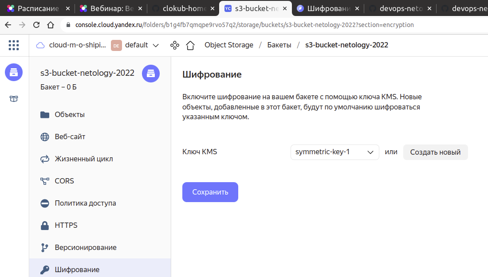
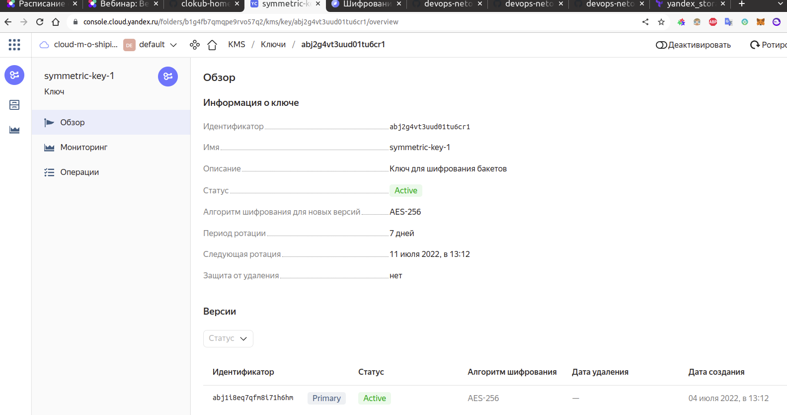

# Домашнее задание к занятию 15.3 "Контексты безопасности. Менеджеры секретов".


## Задание 1. Организация шифрования содержимого S3-бакета.

- Используя конфигурации, выполненные в рамках ДЗ на предыдущем занятии, добавить к созданному ранее bucket S3 возможность шифрования Server-Side, используя общий ключ;
- Включить шифрование SSE-S3 bucket S3 для шифрования всех вновь добавляемых объектов в данный bucket

---

## Задание 2*. Создание сертификата SSL и применение его к ALB.

- Создать сертификат с подтверждением по email;
- Сделать запись в Route53 на собственный поддомен, указав адрес LB;
- Применить к HTTPS запросам на LB созданный ранее сертификат.

---

# Решение


## Задание 1. Организация шифрования содержимого S3-бакета.

Для включения шифрования Server-Side, используя общий ключ, создадим ресурс `yandex_kms_symmetric_key` и добавим в настройки бакета параметр `server_side_encryption_configuration`.

```terraform
# bucket.tf
// Создаем сервисный аккаунт
resource "yandex_iam_service_account" "sa" {
  name        = "service-account"
  description = "service account to manage S3"
}

// Назначаем права
resource "yandex_resourcemanager_folder_iam_member" "sa-editor" {
  folder_id = local.folder_id
  role = "editor"
  member      = "serviceAccount:${yandex_iam_service_account.sa.id}"
  depends_on = [yandex_iam_service_account.sa]
}

// Создаем ключ доступа
resource "yandex_iam_service_account_static_access_key" "sa-static-key" {
  service_account_id = yandex_iam_service_account.sa.id
  description        = "static access key for object storage"
}

// Создаем ключ шифрования
resource "yandex_kms_symmetric_key" "sym-key-1" {
  name              = local.key_name
  description       = local.key_desc
  default_algorithm = "AES_256"
  rotation_period   = "168h"
}

// Создаем бакет
resource "yandex_storage_bucket" "s3" {
  access_key = yandex_iam_service_account_static_access_key.sa-static-key.access_key
  secret_key = yandex_iam_service_account_static_access_key.sa-static-key.secret_key
  bucket = local.bucket_name
  // Включаем шифрование на стороне сервера по умолчанию
  server_side_encryption_configuration {
    rule {
    apply_server_side_encryption_by_default {
      kms_master_key_id = yandex_kms_symmetric_key.sym-key-1.id
      sse_algorithm     = "aws:kms"
    }
  }
  }
}

// Загружаем тестовую картинку в бакет
resource "yandex_storage_object" "test-object" {
  access_key = yandex_iam_service_account_static_access_key.sa-static-key.access_key
  secret_key = yandex_iam_service_account_static_access_key.sa-static-key.secret_key
  bucket = local.bucket_name
  key        = local.object_name # имя объекта в бакете
  source     = local.object_source # относительный путь к файлу, загружаемому как объект.
  acl = "public-read" # открываем доступ на чтение всем
  depends_on = [yandex_storage_bucket.s3]
}
```

Проверяем результат в веб консоли после применения конфигурации:



