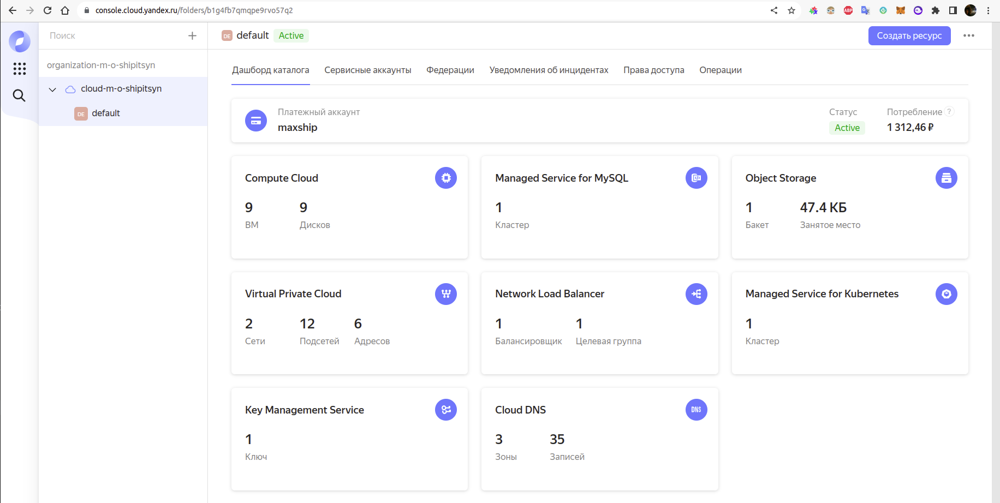
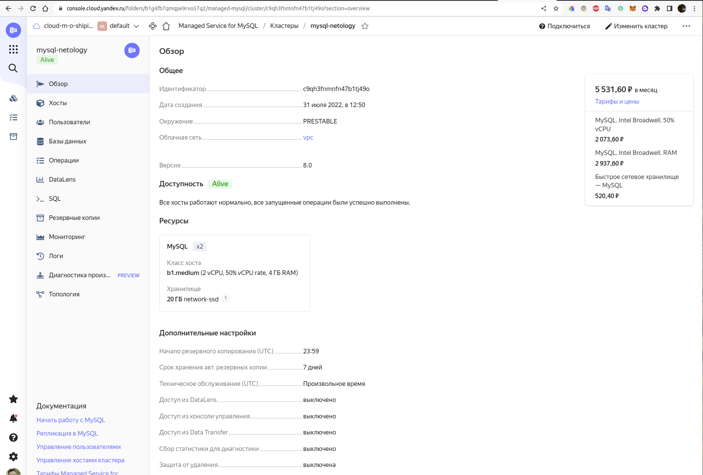
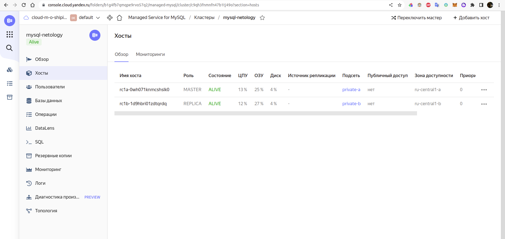
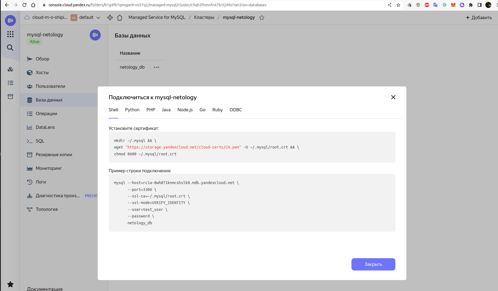
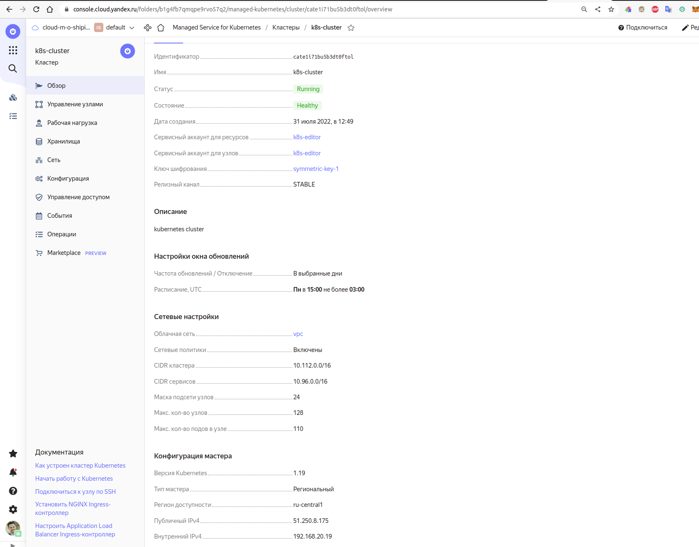
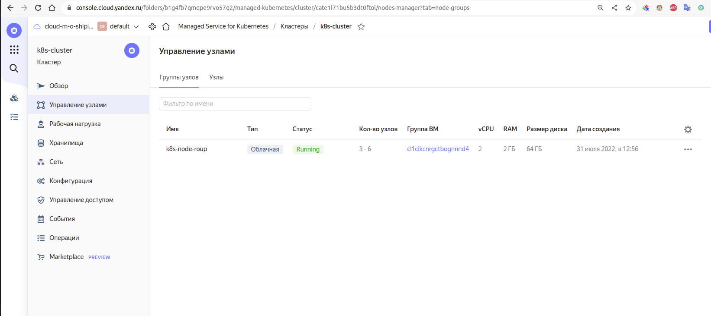
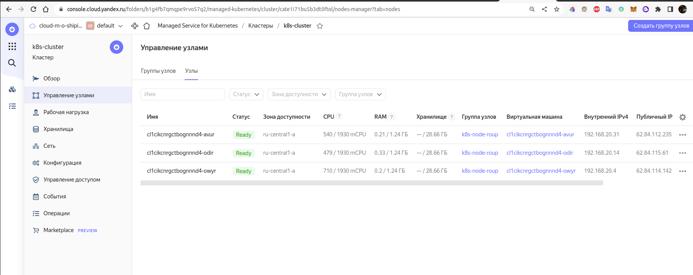
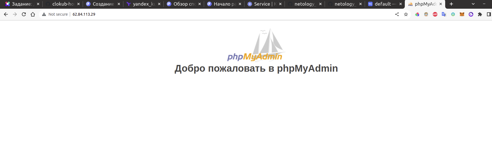

# Домашнее задание к занятию 15.4 "Кластеры. Ресурсы под управлением облачных провайдеров"

Организация кластера Kubernetes и кластера баз данных MySQL в отказоустойчивой архитектуре.
Размещение в private подсетях кластера БД, а в public - кластера Kubernetes.

---
## Задание 1. Яндекс.Облако (обязательное к выполнению)

1. Настроить с помощью Terraform кластер баз данных MySQL:
- Используя настройки VPC с предыдущих ДЗ, добавить дополнительно подсеть private в разных зонах, чтобы обеспечить отказоустойчивость 
- Разместить ноды кластера MySQL в разных подсетях
- Необходимо предусмотреть репликацию с произвольным временем технического обслуживания
- Использовать окружение PRESTABLE, платформу Intel Broadwell с производительностью 50% CPU и размером диска 20 Гб
- Задать время начала резервного копирования - 23:59
- Включить защиту кластера от непреднамеренного удаления
- Создать БД с именем `netology_db` c логином и паролем

2. Настроить с помощью Terraform кластер Kubernetes
- Используя настройки VPC с предыдущих ДЗ, добавить дополнительно 2 подсети public в разных зонах, чтобы обеспечить отказоустойчивость
- Создать отдельный сервис-аккаунт с необходимыми правами 
- Создать региональный мастер kubernetes с размещением нод в разных 3 подсетях
- Добавить возможность шифрования ключом из KMS, созданного в предыдущем ДЗ
- Создать группу узлов состояющую из 3 машин с автомасштабированием до 6
- Подключиться к кластеру с помощью `kubectl`
- *Запустить микросервис phpmyadmin и подключиться к БД, созданной ранее
- *Создать сервис типы Load Balancer и подключиться к phpmyadmin. Предоставить скриншот с публичным адресом и подключением к БД

Документация
- [MySQL cluster](https://registry.terraform.io/providers/yandex-cloud/yandex/latest/docs/resources/mdb_mysql_cluster)
- [Создание кластера kubernetes](https://cloud.yandex.ru/docs/managed-kubernetes/operations/kubernetes-cluster/kubernetes-cluster-create)
- [K8S Cluster](https://registry.terraform.io/providers/yandex-cloud/yandex/latest/docs/resources/kubernetes_cluster)
- [K8S node group](https://registry.terraform.io/providers/yandex-cloud/yandex/latest/docs/resources/kubernetes_node_group)
--- 
## Задание 2. Вариант с AWS (необязательное к выполнению)

1. Настроить с помощью terraform кластер EKS в 3 AZ региона, а также RDS на базе MySQL с поддержкой MultiAZ для репликации и создать 2 readreplica для работы:
- Создать кластер RDS на базе MySQL
- Разместить в Private subnet и обеспечить доступ из public-сети c помощью security-group
- Настроить backup в 7 дней и MultiAZ для обеспечения отказоустойчивости
- Настроить Read prelica в кол-ве 2 шт на 2 AZ.

2. Создать кластер EKS на базе EC2:
- С помощью terraform установить кластер EKS на 3 EC2-инстансах в VPC в public-сети
- Обеспечить доступ до БД RDS в private-сети
- С помощью kubectl установить и запустить контейнер с phpmyadmin (образ взять из docker hub) и проверить подключение к БД RDS
- Подключить ELB (на выбор) к приложению, предоставить скрин

Документация
- [Модуль EKS](https://learn.hashicorp.com/tutorials/terraform/eks)

---

# Решение

## Задание 1. Яндекс.Облако 

Получившаяся конфигурация Terraform находится в директории [terraform](./terraform).

Главное меню консоли:


Кластер mysql:


Хосты mysql:


Параметры подключения:


Кластер кубернетес:


Группа нод:


Рабочие ноды:


Для подключения к кластеру кубернетес через kubectl, воспользовался клиентом YC.

```shell
# получаем конфиг для подключения к кластеру
maxship@Ryzen5-Desktop:~$ yc managed-kubernetes cluster get-credentials k8s-cluster --external --force

Context 'yc-k8s-cluster' was added as default to kubeconfig '/home/maxship/.kube/config'.
Check connection to cluster using 'kubectl cluster-info --kubeconfig /home/maxship/.kube/config'.

Note, that authentication depends on 'yc' and its config profile 'default'.
To access clusters using the Kubernetes API, please use Kubernetes Service Account.

# информация о кластере
maxship@Ryzen5-Desktop:~/devops/devops-netology/15.04-cloud-cluster/terraform$ kubectl cluster-info
Kubernetes control plane is running at https://51.250.8.175
CoreDNS is running at https://51.250.8.175/api/v1/namespaces/kube-system/services/kube-dns:dns/proxy
Metrics-server is running at https://51.250.8.175/api/v1/namespaces/kube-system/services/https:metrics-server:/proxy


maxship@Ryzen5-Desktop:~/devops/devops-netology/15.04-cloud-cluster/terraform$ kubectl get nodes
NAME                        STATUS   ROLES    AGE   VERSION
cl1cikcnrgctbognnnd4-avur   Ready    <none>   21m   v1.19.15
cl1cikcnrgctbognnnd4-odir   Ready    <none>   21m   v1.19.15
cl1cikcnrgctbognnnd4-owyr   Ready    <none>   21m   v1.19.15
```

Запускаем деплоймент + сервис типа LoadBalancer для [phpmyadmin](./deployment/phpmyadmin.yaml)

```shell
maxship@Ryzen5-Desktop:~/devops/devops-netology/15.04-cloud-cluster/terraform$ kubectl apply -f ../deployment/phpmyadmin.yaml 
deployment.apps/phpmyadmin-deployment created
service/phpmyadmin-service created

maxship@Ryzen5-Desktop:~/devops/devops-netology/15.04-cloud-cluster/terraform$ kubectl get po,svc
NAME                                         READY   STATUS    RESTARTS   AGE
pod/phpmyadmin-deployment-657878ff7c-5fdz5   1/1     Running   0          30s
pod/phpmyadmin-deployment-657878ff7c-hlf68   1/1     Running   0          30s

NAME                         TYPE           CLUSTER-IP      EXTERNAL-IP    PORT(S)        AGE
service/kubernetes           ClusterIP      10.96.128.1     <none>         443/TCP        30m
service/phpmyadmin-service   LoadBalancer   10.96.140.170   62.84.113.29   80:31299/TCP   31s
```

Проверяем резальтат:


Балансировщик работает, но зайти не получается. Не могу понять в чем причина.